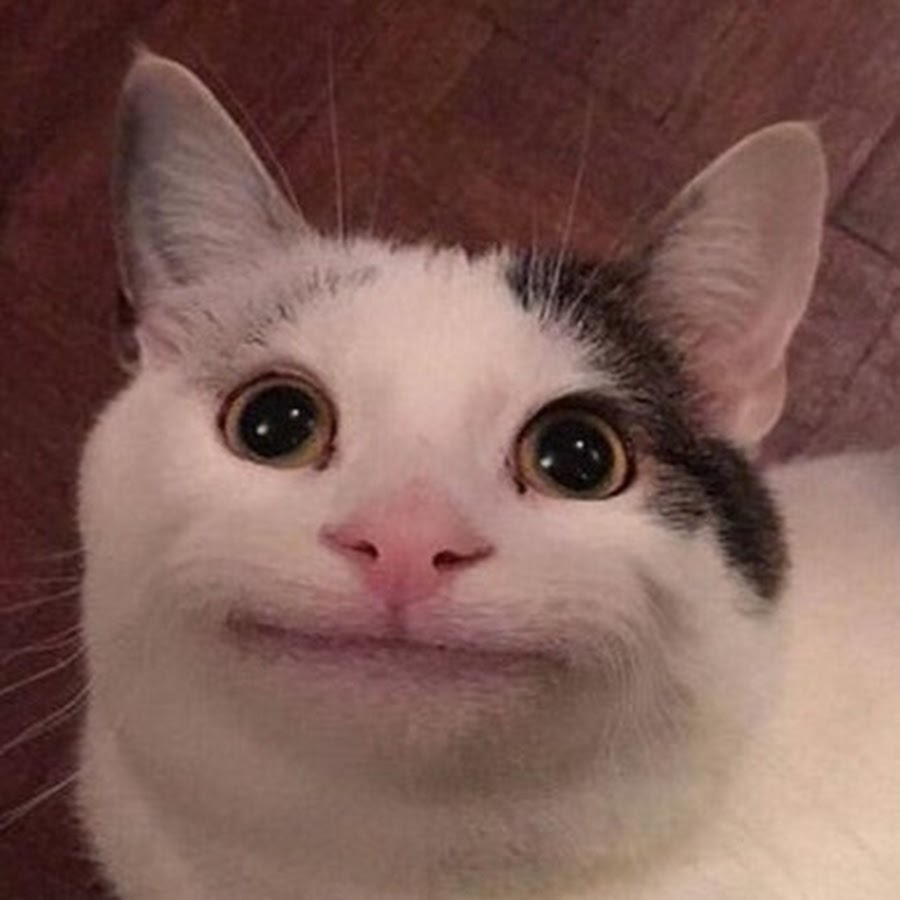

# How to Make a Beautiful Portfolio Website Using Autocode
[](https://notedwin.ga)[<- CLICK ME UwU](https://notedwin.ga)

Haiii:) This open source app will allow you to learn how I made my website and how the animations are made!

Visit [notedwin.ga](https://notedwin.ga) to see how the end result looks like! When I update my website, this app will be updated too UwU

I have detailed guides on how each line will work! Be sure to read all the comments!

## Note
All the pre-existing images in `assets/img` has been deleted due to the project exceeding 80MB limit and unable to save. For now, You can still add your images into `www/assets/img` as long as the image size is small enough. If you face the same problem like me, you might need to upload the image to Discord and copy the image url or use a image hosting website like [imgur](https://imgur.com)

## Features
- One of the most exciting thing in this app is of course the animation and the [nice redirecting URL!](https://www.youtube.com/watch?v=dQw4w9WgXcQ)
- Live Preview this app on [my website](https://notedwin.ga) before trying!
- Teaches you how to create an embed for your website too!
- Unexpected rickroll portfolios!
- Sectionised and easily customizable!
- Works on mobile too!
- Have an awesome readme file you're reading now UwU~~~

## Setup Guide
What?! I thought you guys would never read this description🥺 Alright, I'll walk you through since you guys are so patient with me🤩
1. Open up `www/index.html` and you will be able to change the `description` which will provide a hidden description to Google to know more about your website;
```html
<meta name="description" content="Discord bot developer and Musician"> <!-- This line is for your website's description -->
```

Of course if you provide `og:` aka Open Graph metadatas, you can rank your website higher up in search results!


`og:` metadata properties are the ones which provides SEO data to search engines and is also what can appear as title and descriptions and so on, on other sites when it is embedded.
```html
<meta property="og:site_name" content="NotEdwin"> <!-- This is what appears as your website name when it is embedded in Discord -->
<meta property="og:type" content="website"> 
<meta property="og:title" content="NotEdwin" /> <!-- This is what appears as your website title when it is embedded in Discord -->
<meta property="og:description" content="Discord bot developer and Musician" /> <!-- This is what appears as your website description when it is embedded in Discord -->
<meta property="og:url" content="https://notedwin.api.stdlib.com/portfolio-using-html-in-autocode@dev/" /> <!-- This is your website url when it is embedded in Discord -->
<meta property="og:image" content="https://cdn.discordapp.com/attachments/883205288520466503/894504838245777428/new_logo.png" /> <!-- This is what appears as your thumbnail when it is embedded in Discord -->
```


2. The icons that I used is from a npm package called [boxicons](https://www.npmjs.com/package/boxicons). If you wanna use fancy icons from other places, you can replace the icon style at line 20 in index.html! If you have any issues or troubles configuring it, you can find me in [Autocode Support Server!](https://discord.com/Autocode)


```html
<!-- ===== BOX ICONS ===== -->
<link href='https://cdn.jsdelivr.net/npm/boxicons@latest/css/boxicons.min.css' rel='stylesheet'> <!-- Import all the available social media icons from this website for styling -->
```

`Here comes the MOST IMPORTANT PART!`
--
`You can modify most of the social icons by just changing this to a social media's icon name that you used a lot and link it to your social media there!`
-----


```html
<div class="about__social">
    <a href="https://www.youtube.com/channel/UC3m_fYk3II28l-hD7T8NZ-w" target="_blank" class="about__social-icon"><i class='bx bxl-youtube' ></i></a> <!-- You can always change Youtube to other socials that you have, like Discord -->
    <a href="https://open.spotify.com/artist/6732BSZ5w4CpNbwggCGzXq" target="_blank" class="about__social-icon"><i class='bx bxl-spotify' ></i></a> <!-- You can always change Spotify to other socials that you have, like Facebook or Twitch -->
    <a href="https://www.instagram.com/edwin.nggggggggg" target="_blank" class="about__social-icon"><i class='bx bxl-instagram' ></i></a> <!-- You can always change Instagram to other socials that you have, like Linkedin or Twitter -->
</div>
```

3. One more thing you can modify is of course the images and texts there! all you have to do is upload your images to assets with the exact name of what you wanna replace and you won't have to change it manually in the html file!


## How to get a free domain?
1. Go to `Freenom` and get your own domain by searching a domain.

- For example, you want a domain called `kermituwu.ga`, just search `kermituwu.ga` in the search box!


2. But please note that by just searching `kermituwu`, you might not be able to get the free domain as the site is kinda broke, so you have to search it like how I suggested just now:)


- If you have any doubts about this, feel free to tag me in the [Autocode Discord Server](discord.gg/autocode) or send me a [friend request](https://discordapp.com/users/235721297244585984):)

## How to properly use this open source project?
If you decide to build on top of my project as a template,
Feel free to credit me in the read me and link to my website `https://notedwin.ga`.
You can get a more complete project that I often update from my [Github](https://github.com/Edwin15857/NotEdwin)
Happy hacking as always!